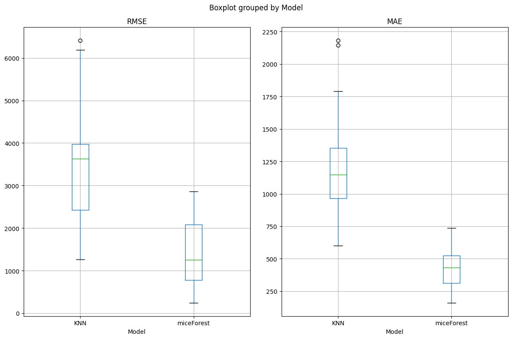

<h1>Modeling and forecasting the volume of salaries for managerial positions in selected companies, listed on the Stock Exchange in Poland</h1>

<h2>Table of contents</h2>

- [Objective](#objective)
- [Data source](#data-source)
- [Features dictionary (PL → ENG)](#features-dictionary-pl--eng)
- [Methods](#methods)
- [Teck stack](#teck-stack)
- [Results](#results)
  - [EDA](#eda)
  - [Imputation of missing values](#imputation-of-missing-values)
  - [Outlier detection](#outlier-detection)
  - [Modelling salary](#modelling-salary)
  - [Feature importance](#feature-importance)
- [Summary](#summary)
- [What might be improved](#what-might-be-improved)
- [Exploring via nbviewer](#exploring-via-nbviewer)

## Objective

This repo summarizes the contest work for the 2nd edition of the [Business Intelligence Case Challenge (BICC)](https://bicc.uek.krakow.pl/), which aimed to forecast volume of salaries for managerial positions in selected companies, listed on the Stock Exchange in Poland. The work took joint **first place** in the contest. In order to achieve the most accurate forecasts, detailed data analyses were carried out and selection of appropriate regression model and optimal parameters was made.

The work was prepared in a team of three. **Visual Studio Code** environment was used to write the code.

## Data source

The data was provided to participants in the form of an Excel file by the organisers of the BICC competition.

## Features dictionary (PL &rarr; ENG)

| Feature (orig.)       | Feature (ENG)                            | Add. Info                                                                                            |
|-----------------------|------------------------------------------|------------------------------------------------------------------------------------------------------|
| Zatrudnienie          | Employment                               |                                                                                                      |
| ROE                   | Return on Equity                         |                                                                                                      |
| ROA                   | Return on Assets                         |                                                                                                      |
| Zysk netto (tys. PLN) | Net profit (thousand PLN)                |                                                                                                      |
| EPS                   | Earnings Per Share                       |                                                                                                      |
| Wartość rynkowa       | Market Value                             |                                                                                                      |
| Funkcja               | Function                                 | specific function or role on the board that the manager performs                                     |
| Obcokrajowiec         | Foreigner                                |                                                                                                      |
| Płeć                  | Gender                                   |                                                                                                      |
| Makrosektor           | Macrosector                              | e.g. finance, IT                                                                                     |
| WIG                   | WIG                                      | an indication of whether the company belongs to one of three indices (or not): WIG20, mWIG40, sWIG80 |
| Skarb Państwa         | Treasury                                 | whether the company is owned by Treasury                                                             |
| Spółka rodzinna       | Family company                           |                                                                                                      |
| KDWWRN                | Supervisory board compensation committee | whether a company has a Supervisory board compensation committee                                     |

## Methods
- Exploratory Data Analysis
  - Missing data
  - Alerts (imbalanced data, high correlation, duplicates)
- Data imputation
- Outlier detection
- Variable transformation
- Hyperparameter tuning

## Teck stack

- Python (refer to requirement.txt for the packages used in this project)

## Results

### EDA

The report indicated that there were 26 duplicate lines. However, it was recognised that duplicatesm can occur when, for example, two people are in the same company in the same position, where equal salary seems highly likely.

It was decided to investigate the collinearity of numerical variables by the inflation factor variance.  However, no variable had a factor value greater than 5 (threshold), which is why it was decided to leave the number of variables at the original level.

One more inconvenience is missing data in the collection. They appear in the variable numerical variable employment (5.9%) and the binary variable KDWWRN (15.2% missing). Due to the small set, it was decided to impute missing values based on the values of the other variables in the rows.

By analysing the graphs, it is possible to draw the hypothesis that the skewness of the distributions deviates from the skewness of the normal distribution and are therefore asymmetric.

It seems that explanatory variables mostly correlated to the *wynagrodzenie* are *wartosc_rynkowa*, *zatrudnienie* and *KDWWRN*.

Scatterplots show more insight relationship between numerical variables.

The relationship between Salary and Net Profit is much more apparent for log-transformed data. It can be seen also that the majority of companies showed a positive financial result.

### Imputation of missing values

One of the variables with gaps was the column *employment*. It contains more than 5% of missing data. In testing the imputation algorithms (kNN and miceForest), 30 iterations were performed, where in each iteration the following were calculated. As can be seen, the miceForest algorithm performs significantly better on both measures, This is why it was chosen for the imputation of the *employment* variable.

In the case of the variable *KDWWRN* there is a greater problem of missing rows in both the training set and the test set, and there are also many more rows with missing rows It was again decided to test the miceForest algorithm.

The tests were carried out over 40 iterations, where two values were considered for boosting parameter:
- Random Forest (standard one),
- gbdt (Gradient Boosting Decision Trees).

| Boosting     | Precision | Recall | F1     |
|--------------|-----------|--------|--------|
| gbdt         | 0.9731    | 0.9607 | 0.9657 |
| randomForest | 0.9744    | 0.9466 | 0.9578 |

In general, an algorithm with both parameter values boosting performs very well, however, the gdbt boosting performs slightly better.

### Outlier detection

In order to identify anomalies DBSCAN (Density Based Spatial Clustering of Applica tions with Noise) was used.

Figure shows a graph of the k nearest neighbours (k-NN distance). The horizontal axis shows the numbers of observations, while the vertical axis shows the the distances to the k nearest neighbours. This graph is used to analyse data density and identification of potential outliers. On its basis it was decided to set parameter *epsilon* = 2.

Principal Component Analysis was used to visualise outlier observations and a two-dimensional scatter plot was created. For this analysis, the first two principal components explain 70,10% of the variance, allowing us to focus on the most significant aspects. Outlier observations are highlighted in orange on the graph and their percentage of is equal to 2.39%.

### Modelling salary

Due to the strong right-handedness of the distribution of the variable endogenous variable, it was decided to use the *Yeo-Johnson* transformation, which modifies the values of the variable so that its distribution is close to a normal one.

To select the best regression model it was decided to compare a set of regression models
effective in predicting continuous variables, where exogenous variables include categorical variables. The models considered for evaluation included:

- RandomForestRegressor,
- CatBoostRegressor,
- XGBRegressor.

In the data set for the variable *skarb_panstwa*, there are only 16 records with the value  and "YES" This high disparity between classes may lead to poor generalisation of the model, negatively affecting the quality of the forecasts. In order to maintain balance and avoid misinterpretations, it was decided to exclude the variable *skarb_panstwa* . After a trial-and-error method, it was also decided to remove the variable related to gender. Due to the small dataset and large disparity, no multivariate analysis of variance was applied to determine whether there was a gender pay gap.

In order to find the optimal predictive model, an analysis was carried out in which the Mean Absolute Error was minimised. MAE is one of the most popular model evaluation metrics, which measures the mean absolute value of the difference between actual and predicted values. In addition, MAE is more robust to outlier observations. The lower the MAE value, the better the quality of the regression model.

After 500 iterations with different set of hyperparameters and five K-Folds in each iteration, the best model proved to be XGBRegressor. Lowest mean of MAE scores was **178,596.37 (PLN).**

### Feature importance

Feature importance of XGBRegressor has shown that most important features where *wartosc_rynkowa* and *zatrudnienie*.

Once the parameter optimisation process and variable validity analysis had been completed, the XGBRegressor model was trained on the full set of available data. Then, using this trained model, forecasting was performed on the set of test set. The results of the forecasts were compiled in an *Excel file*, which is attached to the this work.

| Stat     | Value           |
|----------|-----------------|
| nobs     | 120             |
| min      | 32,838          |
| max      | 2,434,128       |
| mean     | 568,157         |
| variance | 171,258,190,564 |
| skewness | 1.37            |
| kurtosis | 2.94            |

Table above shows basic statistics for the prediction of the test set data.

## Summary

In this work, a comprehensive analysis of the data was carried out and an selection of the optimal regression model for accurate forecasting of continuous variables. After optimisation parameters using *Optuna* library, the final choice was the XGBRegressor model, which achieved the lowest mean absolute error (MAE). 

## What might be improved

Mean MAE of 178,596.37 (PLN) indicates that a lot may be improved. However, the dataset was very small, thus it might be cumbersome to produce significantly better results. Since there are some features concerning financial data of the companies, much more info could be extracted from ROE, ROA, net profit and market value (e.g. equity, assets).

## Exploring via nbviewer

Explore the notebook file [here](https://nbviewer.org/github/KonTra7cf/ManagerialSalaryModelling/blob/main/salary_prediction.ipynb)